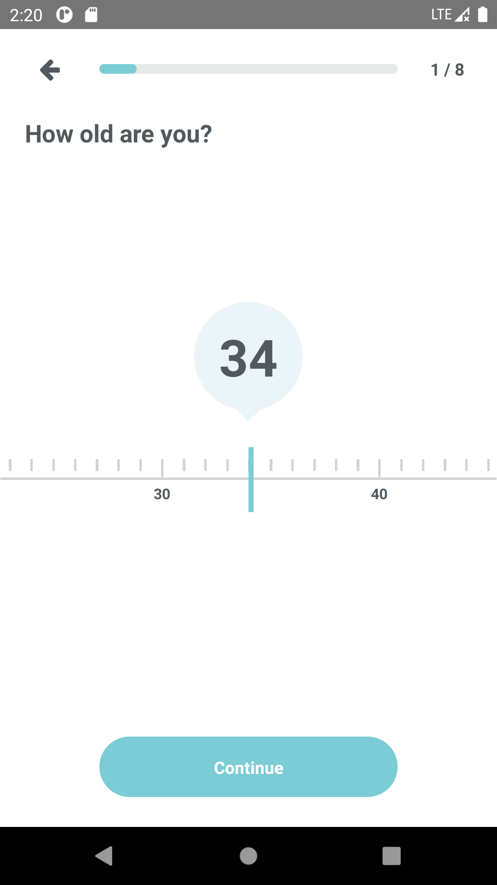
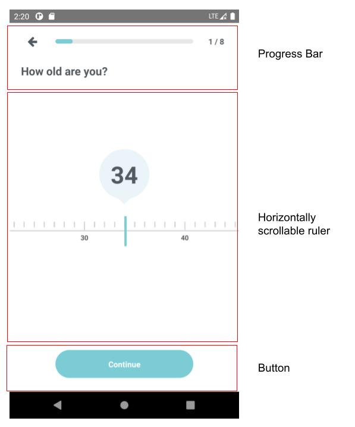

### Architecture Design
With the assumption that we have many different services from 3rd parties and updates regularly, the super app should be separated from all other 3rd parties services, so that they can be deployed independently. A set of bridge APIs (different UI updates, success or error event handling, etc.) will be needed to connect the super app with the 3rd parties services. 
Honestly I’m not familiar with mobile app deployment, so I will just write about web deployment. In order to provide the updated version quickly to the customer, I will choose Jenkin to automate the pipeline. It allows us to run a set of tasks before releases, like Sonarqube for code quality and security check, or e2e tests to ensure functionality, etc. 

### Programming

  
<a href="https://drive.google.com/file/d/1gWcg7Lsc_LlFlfVkT72EGSLcQlhz70vb/view?usp=sharing" 
target="_blank">result app video</a> 
I devided the screen into 3 section as above. I assume the main feature will be the middle section in the screen, it should be a horizontally scrollable view, and the number in the center should be change as the user scroll. I used the source code from <a href="https://gitlab.com/yxuko/react-native-slider-ruler/-/tree/master" target="_blank">this repo</a> and customized the style to match the design.
  
Honestly this is my first react native app. I was planning to make an IOS app with swift which I have more experience on, but when I tried to reinstall xcode in order to upgrade the version, my Macbook ran out of storage, and I wasn’t able to do any implementation on my Macbook. So I choose to start something new, use my Windows10 to learn React Native. It took me long to build the dev environment and get the app start running. The app is probably not structured very well, but thanks for giving me the chance to try it out. :)
