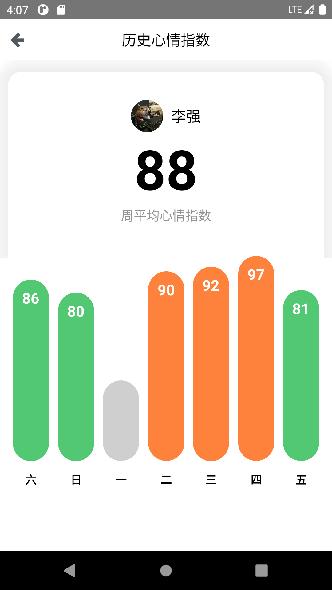

### Architecture Design
With the assumption that we have many different services from 3rd parties and updates regularly, the super app should be separated from all other 3rd parties services, so that they can be deployed independently. A set of bridge APIs (different UI updates, success or error event handling, etc.) will be needed to connect the super app with the 3rd parties services. 
Honestly I’m not familiar with mobile app deployment, so I will just write about web deployment. In order to provide the updated version quickly to the customer, I will choose Jenkin to automate the pipeline. It allows us to run a set of tasks before releases, like Sonarqube for code quality and security check, or e2e tests to ensure functionality, etc. 

### Programming
  
<a href="https://drive.google.com/file/d/1sTSWXuI-b_DhzUt3ePfJMg3xUSSUK0Wh/view?usp=sharing" 
target="_blank">result app video</a> 

